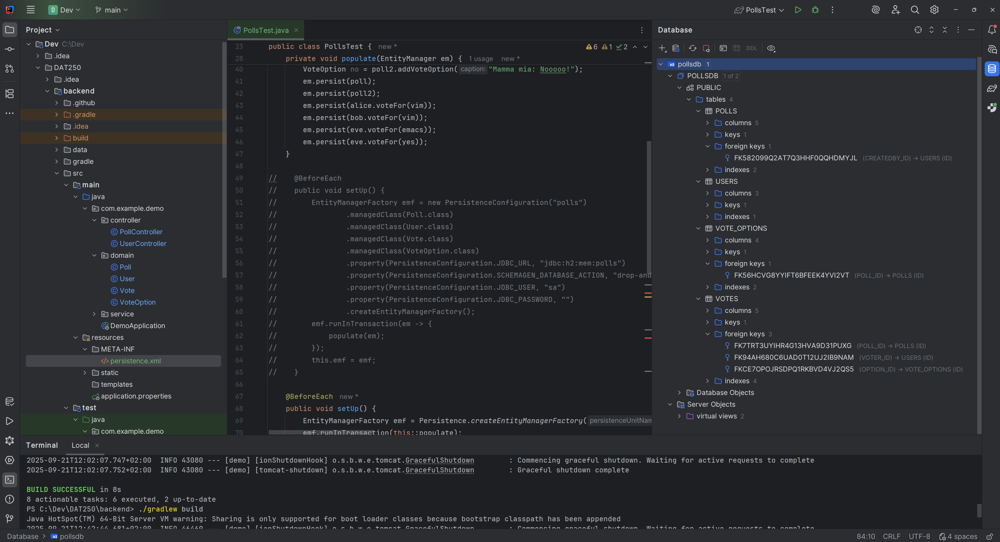

###### Link to personal repository of this project: https://github.com/671454/DAT250-exercise2/tree/main/backend

### JPA
Some of the annotations used include:
- @Id
  @GeneratedValue(strategy = GenerationType.IDENTITY)
Used to create unique IDs.

- @ManyToOne/OneToMany(optional = false, fetch = FetchType.LAZY)
Used to map relation between entities. Fetch typer LAZY were used on all relations, so that no relations is loaded until
I explicitly asks for it.

- @JsonIdentityReference(alwaysAsId = true)
Jacksons (de)serialization of objects. Includes only ID of relations.

- @Entity 
Marks a class to interpreted as an entity.

- @Table(name = e.g "polls")
To avoid conflictions regarding reserved qwords in SQl.

### Equals and hashcodes in entities
Every entity has its own equals and hashcode methods based on ID. This is to consistently be able to compare objects.

### Tests
The PollsTest.java class uses only Hibernate via an EntityManger instance to create data, and retrieve data via JPQL. 
Because my annotation of the domain/entity classes were correctly implemented these tests ran without problems.

My own end-2-end test (E2ETest.java) from the previous exercise, which tests the REST layer of the application, was 
not prepared to work with the newly modified entity structures. 
The problem was caused by Jackson's deserialization of numeric objects, where JSON does not care if the numeric
value is of type Integer or Long. As a result, values I expected as Long in Java where deserialized to Integer. 
To fix this, I had to manually cast to the general Number type first, and then convert to the expected Long.

#### Solution to this casting problems
The type-casting problem explained above, could probably have been avoided by using DTOs (Data Transfer Object). 
These simple java objects is used to transport data between client and server and explicitly defines which field 
is to be in JSON and with their respective datatypes.
If I had used DTOs instead of working with raw Map<String, Object>, Jackson would have taken care of deserialization
automatically, and I would not have to deal with type-casting. This would have made the code cleaner and more elegant, maintainable
and error-prone.

## Screenshot of entities in H2 DB
To be able to inspect the entities in DB, I had to replace PersistenceConfiguration("polls") setup in PollsTest with my 
own EntityFactory configured via a persistence.xml file.
By using this:<property name="jakarta.persistence.jdbc.url" value="jdbc:h2:file:./data/pollsdb"/>, the test class produced 
a "pollsdb.mv.db" file which I linked to Intellij's built-in DB viewer. The screenshot below shows the expected entities
and FKs present in the H2 DB. 

