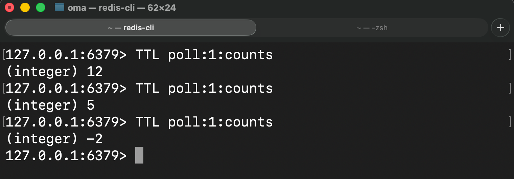
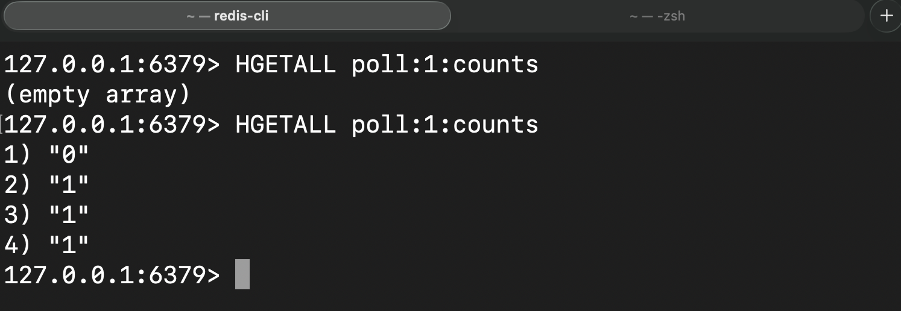

# Report on Software Experiment 5: Redis

Started by downloading Redis locally, and then added these dependencies:
- implementation("org.springframework.boot:spring-boot-starter-data-redis")
- implementation("redis.clients:jedis:6.2.0")

Then I instantiated a jedis connection in main on port 6379 like this:
UnifiedJedis jedis = new UnifiedJedis("redis://localhost:6379");

For use case 1 and 2 I used functions like sadd, srem, del, hset, smembers, sismember
to create, delete and check users and polls.
The keys is hierarchically structured like this ("poll:" + pollId + ":captions"/":counts"...)
and so on. 

A VoteCacheCount service class was created and used as a cache instance in PollController.
This service provides cache lookups for requests to the polls page, with a TTL of 20 sec. 

This method generates the keys used in redis cache:

    private String countsKey(Long pollId) {
        return "poll:" + pollId + ":counts";
    }

This invalidates/removes a poll after a vote:

    public void invalidate(Long pollId) {
        jedis.del(countsKey(pollId));
    }

The service consists also of these methods:
- public Map<Integer, Long> getCountsCached(Long pollId)
  - Returns cached data if hit, or computes data from memory/DB when there is a cache-miss.
- private Map<Integer, Long> computeFromMem(Long pollId)
  - Uses manager instance to retrieve data from memory/DB.

The image shows the TTL of poll with id of 1 after loading the page

This shows the poll not being in cache, and then gets added after a new page-load
