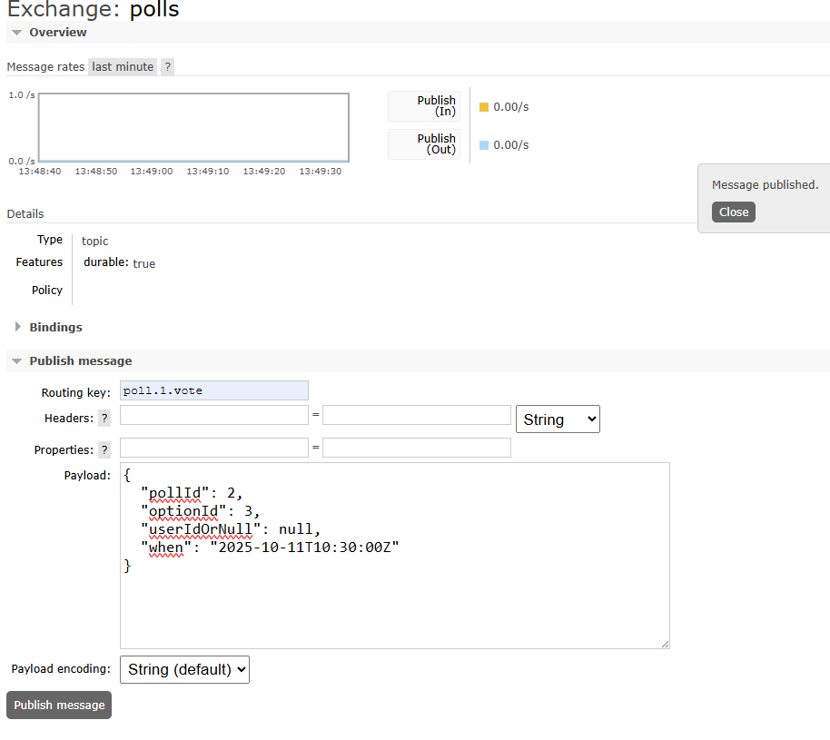

# Software Technology Experiment Assignment 6

### This markdown file contains technical solution and experiments.
The only technical problem I encountered during this experiment, was that old vote-events sent from RabbitMQs UI 
that had not yet been processed before the server got shut down, would cause errors when turning the server back up again,
"NoSuchElementException". (or at least I think this was the reason for the error)
 - Fixed by using "docker compose down" that cleared the cache.

This exercise was completed by implementing these classes:
 - @Service: EventPublisher
 - Two DTOs: VoteEvent and PollCreatedEvent
 - @Component: BrokerVoteListener
 - @Configuration: RabbitMQConfig
 - Stand-alone client: PollClient (Producer/Consumer)

I also needed to make adjustment to:
 - PollController: make use of EventPublisher when creating a poll and voting
 - PollManagerV2: allow for anonymous votes.
 - docker-compose.yml: to run the RabbitMQ container 

# Technical experiment with anonymous voting
This shows my stand-alone client that is a consumer and producer of messages on routing-key "poll.1.*"
The client creates an anonymous vote, then receives it back again. It also receives messages from HTTP.

## Other experiments

### Creating a poll, and then a GET-req on it:

### Which produces this result, with currently zero votes:

### Then sends a vote with userId of null via RabbitMQs admin-page:

### And as a result we can see the vote is actually registered:
